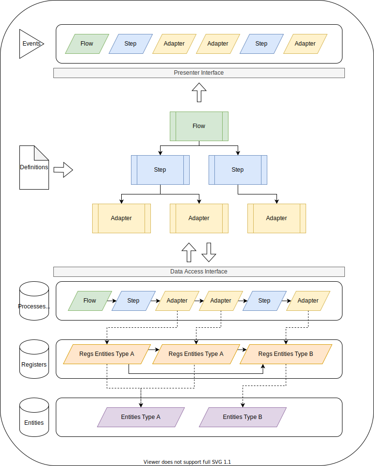

## Introduction
- https://github.com/AsierEHU/etl-node-fw
- https://www.npmjs.com/package/etl-node-fw


ETL Node Framework is a tool focused on ETL best practices.

Observability by default:
- Data lineage
- Traces
- Events
- Metrics
- Documentation
- Testing

Tools for:
- Ensuring data quality
- Managing bad data
- Error handling
---
## ETL Framework concepts
### Entities
Input and Ouput raw payload. The information that you want to Extract, Transform and Load.
### Registers
Meta information about the entities after being processed.
Keep Sync context, data lineage and process status data.
### Adapters
Run the Definition about how to ETL entities.
Each adapter produce only one Entity type.
Can force to implement some validations to ensure data quality, error prevention and decisions about how to manage bad data.
Can Work in "Push" or "Pull" modes.
- "Pull Mode" (default): Adapter is in charge of obtain the input entities. 
- "Push Mode": Adapter only obtain previously loaded entities. Used special reserved [$]AdapterId: $pushEntity

Types:
- **Extractors**: Input new entities into the flow.
- **Transformers**: Create new entities from existing entities.
    - Row: Unique Row source needed for the output
    - Set: One or more Sets of data needed for the output
- **Loaders**: Save entities into the final storage. Save ouput resuls.
### Steps
Define how an Adapter must be ran in an specific Flow.
Can run adapters in "Push" and "Pull" mode.
Implements some error handling tools like retries and force to define how the flow must continue in case of not success.
### Flows
Define the order execution and dependencies between steps.

---
## ETL Framework patterns
- **Definitions**: Behaviour configuration. Acts like process documentation.
- **Processes**: Tranform a definition into a result. Return summaraized results (monitoring).
- **Runners**: Run Processes exposing their status changes, errors and metrics.
- **Factories**: Create new runners by definition.
- **DataAccess**: Interface for handling Entities and Registers
- **presenters**: Event channels with Status and Errors information.
---
## Examples / how it works [WIP]
``` ts
import { AdapterFactory, AdapterPresenter, FlowFactory, FlowPresenter, LocalAdapterExtractorDefinition, LocalAdapterLoaderDefinition, LocalAdapterTransformerRowDefinition, LocalLinealFlowDefinition, LocalStepDefinition, RegisterStats, StepFactory, StepPresenter, ToFixEntity, ValidationResult, ValidationStatusTag, VolatileProcessStatusDataAccess, VolatileRegisterDataAccess } from 'etl-node-fw'
import EventEmitter from 'events'

/********************************
 * 3 Steps lineal flow example.
 ********************************/
// In this example we are going to download some entities from a fake API.
// Then, sum their fields.
// Finally, load entities in our fakeDB


// Part 1
// Entities data types
// Define the data structures you are going to work on

type flowConfig = {
    apiCallConfig: any
}

type extractEntity = {
    field1: number,
    field2: number,
}

type transformEntity = {
    field3: number,
}

type loadEntity = {
    correctlyLoaded: boolean,
}


// Part 2
// Adapters definitions
// Define how to rule entities

function myFakeApiFetch(apiCallConfig: any): (extractEntity | null)[] {
    return [
        {
            field1: 24,
            field2: 23,
        },
        null,
        {
            field1: -1,
            field2: 3,
        },
    ]
}
function myFakeDBLoad(entity: transformEntity): boolean {
    return true
}

const extractorDefinition: LocalAdapterExtractorDefinition<extractEntity> = {
    id: "extractEntityDefinition", //uniqe definition id
    definitionType: "LocalAdapterExtractorDefinition",
    outputType: "extractEntity", //Entity type
    /**
     * Load entities into the flow as Registers
     * @param entityFetcher Tool for fetching Registers
     * @returns You can return a combination of raw entities or entities with meta (for extra information into the Register).
     */
    async entitiesGet(entityFetcher) {
        const flowConfig: flowConfig = await entityFetcher.getFlowConfig()
        const extractedEntities = myFakeApiFetch(flowConfig.apiCallConfig)
        const extractedEntitiesWithMeta = extractedEntities.map((extractedEntity, index) => {
            return {
                $entity: extractedEntity,
                $meta: "Example entity",
                $id: "myIndexedId" + index
            }
        })
        return extractedEntitiesWithMeta
    },
    /**
     * Apply validations to each entity
     * @param entity 
     * @returns 
     */
    async entityValidate(entity: extractEntity | null) {
        if (entity == null) {
            return {
                statusTag: ValidationStatusTag.invalid,
                meta: {
                    type: "null object",
                }
            };
        }
        else if (entity.field1 == -1) {
            return ValidationStatusTag.invalid;
        }
        else {
            return ValidationStatusTag.valid;
        }
    },
    /**
     * Sometimes you can apply instant fixes to Invalid entities
     * @param toFixEntity 
     * @returns 
     */
    async entityFix(toFixEntity: ToFixEntity<extractEntity>) {
        const entity = toFixEntity.entity;
        if (!entity) {
            return null;
        }
        else if (entity.field1 == -1) {
            entity.field1 = 0
            return {
                entity,
                meta: {
                    note: "Fixed changing to 1"
                }
            };
        } else {
            return null;
        }
    },
}

const transformerDefinition: LocalAdapterTransformerRowDefinition<extractEntity, transformEntity> = {
    id: "transformEntityDefinition",
    definitionType: "LocalAdapterTransformerRowDefinition",
    inputType: "extractEntity",
    outputType: "transformEntity",
    async entityProcess(entity: extractEntity) {
        return {
            field3: entity.field1 + entity.field2
        }
    },
}

const loaderDefinition: LocalAdapterLoaderDefinition<transformEntity, loadEntity> = {
    id: "loadEntityDefinition",
    definitionType: "LocalAdapterLoaderDefinition",
    inputType: "transformEntity",
    outputType: "loadEntity",
    async entityLoad(entity: transformEntity) {
        return {
            correctlyLoaded: myFakeDBLoad(entity)
        }
    },
    /**
     * Once you have the api result, you can validate
     * @param inputEntity 
     * @returns 
     */
    async entityValidate(inputEntity: loadEntity | null): Promise<ValidationResult | ValidationStatusTag> {
        if (inputEntity?.correctlyLoaded == true) {
            return ValidationStatusTag.valid
        } else {
            return ValidationStatusTag.invalid
        }
    }
}

// Part 3
// Step definition
// Define how to run an adapter in a flow

const extractorStepDefinition: LocalStepDefinition = {
    id: "extractStepDefinition", //uniqe definition id
    adapterDefinitionId: "extractEntityDefinition",
    maxRetries: 0, //In case of Adapter fails or any Register Fails, the number of retries
    definitionType: "LocalStepDefinition",
    /**
     * Sometimes you need to tag an step as invalid, for example, if you get 0 entities, it is a 'success' result but is not Valid for your business.
     * @param statusSummary 
     * @returns 
     */
    isInvalidRegistersSummary: function (statusSummary: RegisterStats): boolean {
        return false
    },
    adapterRunOptions: null //Force to run adapter with specified params
}

const transformerStepDefinition: LocalStepDefinition = {
    id: "transformStepDefinition", //uniqe definition id
    adapterDefinitionId: "transformEntityDefinition",
    maxRetries: 1, //In case of Adapter fails or any Register Fails, the number of retries
    definitionType: "LocalStepDefinition",
    /**
     * Sometimes you need to tag an step as invalid, for example, if you get 0 entities, it is a 'success' result but is not Valid for your business.
     * @param statusSummary 
     * @returns 
     */
    isInvalidRegistersSummary: function (statusSummary: RegisterStats): boolean {
        return false
    },
    adapterRunOptions: null //Force to run adapter with specified params
}

const loaderStepDefinition: LocalStepDefinition = {
    id: "loadStepDefinition", //uniqe definition id
    adapterDefinitionId: "loadEntityDefinition",
    maxRetries: 3, //In case of Adapter fails or any Register Fails, the number of retries
    definitionType: "LocalStepDefinition",
    /**
     * Sometimes you need to tag an step as invalid, for example, if you get 0 entities, it is a 'success' result but is not Valid for your business.
     * @param statusSummary 
     * @returns 
     */
    isInvalidRegistersSummary: function (statusSummary: RegisterStats): boolean {
        return false
    },
    adapterRunOptions: null //Force to run adapter with specified params
}

// Part 4
// Flow definition
// Define run order

const testFlow1Definition: LocalLinealFlowDefinition = {
    id: "testFlow1", //uniqe definition id
    definitionType: "LocalLinealFlowDefinition",
    stepsDefinitionFlow: [
        { id: "extractStepDefinition", successMandatory: true },
        { id: "transformStepDefinition", successMandatory: true },
        { id: "loadStepDefinition", successMandatory: true }
    ] //Steps run order. Use successMandatory if you want to stop the flow ("failed") in case of not step "success" result.
}

// Part 5
//  DataAccess, Presenters and Factories
// All the configurations and classes you need to plugin

const presenter = new EventEmitter()
const registerDataAccess = new VolatileRegisterDataAccess()
const processStatusDataAccess = new VolatileProcessStatusDataAccess()

//Adapter dependencies
presenter.on("adapterStatus", (adapterStatus: AdapterPresenter) => {
    console.log(adapterStatus)
})
presenter.on("adapterError", (adapterError) => {
    console.error(adapterError)
})
const adapterDependencies = {
    adapterPresenter: presenter,
    registerDataAccess,
    processStatusDataAccess
}
const adapterDefinitions = [extractorDefinition, transformerDefinition, loaderDefinition]
const adapterFactory = new AdapterFactory(adapterDefinitions, adapterDependencies)

//Step dependencies
presenter.on("stepStatus", (stepStatus: StepPresenter) => {
    console.log(stepStatus)
})
presenter.on("stepError", (stepError) => {
    console.error(stepError)
})
const stepDependencies = {
    stepPresenter: presenter,
    registerDataAccess: registerDataAccess,
    processStatusDataAccess,
    adapterFactory
}
const stepDefinitions = [extractorStepDefinition, transformerStepDefinition, loaderStepDefinition]
const stepFactory = new StepFactory(stepDefinitions, stepDependencies)

//Flow dependencies
presenter.on("flowStatus", (flowStatus: FlowPresenter) => {
    console.log(flowStatus)
})
presenter.on("flowError", (flowError) => {
    console.error(flowError)
})
const flowDependencies = {
    flowPresenter: presenter,
    registerDataAccess,
    processStatusDataAccess,
    stepFactory
}
const flowDefinitions = [testFlow1Definition]
const flowFactory = new FlowFactory(flowDefinitions, flowDependencies)

// Part 6
// Run
//You can run an Adapter, an Step or a Flow independently.
//In this example, we run a Flow
async function run() {
    const flowRunner = flowFactory.createFlowRunner("testFlow1")
    await flowRunner.run({
        flowConfig: {
            apiCallConfig: "testConfig"
        }
    })

    const registers = await registerDataAccess.getAll()
    console.log(registers)
    //8 Registers (1 flowConfig, 3 extracted, 2 transformed, 2 loaded)

    const processesStatus = await processStatusDataAccess.getAll()
    console.log(processesStatus)
    //7 entries: 'testFlow1,'extractStepDefinition','extractEntityDefinition',
    // 'transformStepDefinition',''transformEntityDefinition','loadStepDefinition','loadEntityDefinition'
}
run()
```
---
## Reference [WIP]
### Architecture

### Register data structure
``` ts
{
    id: string //unique identifier
    entityType: string 
    sourceRelativeId: string | null //relative (last register source) datalineage
    sourceAbsoluteId: string | null //absolute (first register source) datalineage
    sourceEntityId: string | null //user custom datalineage
    statusTag: RegisterStatusTag 
    //- pending: register pending to be proccessed,
    //- success: register saved with success result -> not errors, validations passed,
    //- failed: register saved with failed result -> unexpected/software error,
    //- invalid: register saved with invalid result -> validation not passed,
    //- skipped: register saved with skipped result -> tagged as not necessary by definition,
    statusMeta: RegisterMeta //extra info about the register status
    entity: object | null, //entity
    meta: RegisterMeta, //user custom meta
    date: Date, //creation date
    definitionId: string //definition  trace
    syncContext: SyncContext //process traces (flowId,stepId,AdapterId)
}
```
Special entityType reserved:
- $flowConfig: Used for define Flow configuration
- $setRegister: Used for define a Set of registers

### Status data structure
Adapter, Step or Flow process status entry.
``` ts
{
    id: string //process unique identifier
    definitionId: string //definition identifier
    statusTag: ProcessStatus
    //- pending: process pending to be proccessed,
    //- success: process finished with success result -> not software exceptions
    //- failed: process finished with exceptions
    //- invalid: process tagged invalid by definition
    statusMeta: //extra info about the process status
    timeStarted: Date | null
    timeFinished: Date | null
    runOptions: any //process input params
    syncContext: SyncContext //process traces (flowId,stepId,AdapterId)
    processType: ProcessType //flow,step,adapter
}
```
### Presenter data structure
Adapter, Step or Flow process status event.
``` ts
{
    id: string //process unique identifier
    definitionId: string //definition identifier
    definitionType: string //definition type
    outputType: string //process output entity type
    statusTag: ProcessStatus
    //- pending: process pending to be proccessed,
    //- success: process finished with success result -> not software exceptions
    //- failed: process finished with exceptions
    //- invalid: process tagged invalid by definition
    statusMeta: //extra info about the process status
    timeStarted: Date | null
    timeFinished: Date | null
    statusSummary: any, //metrics about the process
    runOptions: any //process input params
    syncContext: SyncContext //process traces (flowId,stepId,AdapterId)
}
```
### DataLineage

---
## Default implementations overview
### Adapters
- **LocalAdapter family**: For small sets running in one local computer
    - **LocalAdapterExtractor**: Enforce data quality and error prevention applying validators. Can apply automatic clean-up actions or tagging as "invalid" records for triage.
    - **LocalAdapterRowTransformer**: Row by row transformation.
    - **LocalAdapterSetTransformer**: Sets to rows transformation.
    - **LocalAdapterLoader**: Apply output validations to check entities has been loaded correctly.
- **LocalAdapterRunner**: Check status for local adapters. Set "failed" status in case of any adapter (not register) exception thrown.
    - "adapterStatus" channel: for status change events.
    - "adapterError" channel: for exceptions raised.
### Steps
- **LocalStep**: Retries config for failed Records and Adapters. Can define invalid status depending on the final records summary defined in the definition config.
- **LocalStepRunner**: Check status for local steps. Sets "failed" status in case of any step exception thrown. Sets "invalid" status in case of definition invalid exception.
    - "stepStatus" channel: for status change events.
    - "stepError" channel: for exceptions raised.
### Flows
- **LocalLinealFlow**: Run steps one by one in the defined order. Can force tu use specific params in each Step, and apply an error response behavior depending of the Step sucssesfullness.
- **LocalLinealFlowRunner**: Check status for local flows. Sets "failed" status in case of any flow exception thrown. Flow finishing with pending for run steps will be considered an exception and tagged wit status "failed". 
    - "flowStatus" channel: for status change events.
    - "flowError" channel: for exceptions raised.
---
## Extensibility [WIP]
- Developing own ETL Elements
- Testing
---
## Next features [WIP]
- Process in batch (reducers)
- Tree flows (instead of lineal)
- Document store
- SQL store
- Stage tables adapters
- Continue process from last state
